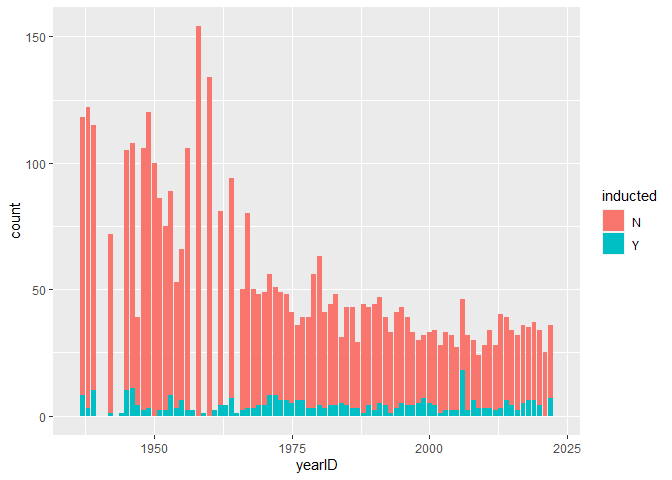

<!-- README.md is generated from README.Rmd. Please edit the README.Rmd file -->

# Zane Eason Lab Report Progress/Notes

``` r
library(rvest)
```

    ## 
    ## Attaching package: 'rvest'

    ## The following object is masked from 'package:readr':
    ## 
    ##     guess_encoding

``` r
library(dplyr)
hof <- Lahman::HallOfFame
url <- "https://www.baseball-reference.com/awards/hof_2023.shtml"
html <- read_html(url)
tables <- html_table(html)

tables <- tables[[1]]

head(tables)
```

    ## # A tibble: 6 × 39
    ##   ``    ``           ``    ``    ``    ``    ``    ``    ``    ``    ``    ``   
    ##   <chr> <chr>        <chr> <chr> <chr> <chr> <chr> <chr> <chr> <chr> <chr> <chr>
    ## 1 Rk    Name         YoB   Votes %vote HOFm  HOFs  Yrs   WAR   WAR7  JAWS  Jpos 
    ## 2 1     Scott Rolen  6th   297   76.3% 99    40    17    70.1  43.6  56.9  56.3 
    ## 3 2     Todd Helton… 5th   281   72.2% 175   59    17    61.8  46.6  54.2  53.4 
    ## 4 3     Billy Wagner 8th   265   68.1% 107   24    16    27.7  19.8  23.7  32.5 
    ## 5 4     Andruw Jones 6th   226   58.1% 109   34    17    62.7  46.4  54.6  58.2 
    ## 6 5     Gary Sheffi… 9th   214   55.0% 158   61    22    60.5  38.0  49.3  56.7 
    ## # ℹ 27 more variables: `Batting Stats` <chr>, `Batting Stats` <chr>,
    ## #   `Batting Stats` <chr>, `Batting Stats` <chr>, `Batting Stats` <chr>,
    ## #   `Batting Stats` <chr>, `Batting Stats` <chr>, `Batting Stats` <chr>,
    ## #   `Batting Stats` <chr>, `Batting Stats` <chr>, `Batting Stats` <chr>,
    ## #   `Batting Stats` <chr>, `Batting Stats` <chr>, `Pitching Stats` <chr>,
    ## #   `Pitching Stats` <chr>, `Pitching Stats` <chr>, `Pitching Stats` <chr>,
    ## #   `Pitching Stats` <chr>, `Pitching Stats` <chr>, `Pitching Stats` <chr>, …

``` r
write.csv(tables, "temp.csv", row.names=FALSE)
backin <- readr::read_csv("temp.csv", skip = 1, show_col_types = FALSE)
```

    ## New names:
    ## • `G` -> `G...13`
    ## • `H` -> `H...16`
    ## • `HR` -> `HR...17`
    ## • `BB` -> `BB...20`
    ## • `G` -> `G...31`
    ## • `H` -> `H...35`
    ## • `HR` -> `HR...36`
    ## • `BB` -> `BB...37`

``` r
head(backin)
```

    ## # A tibble: 6 × 39
    ##      Rk Name       YoB   Votes `%vote`  HOFm  HOFs   Yrs   WAR  WAR7  JAWS  Jpos
    ##   <dbl> <chr>      <chr> <dbl> <chr>   <dbl> <dbl> <dbl> <dbl> <dbl> <dbl> <dbl>
    ## 1     1 Scott Rol… 6th     297 76.3%      99    40    17  70.1  43.6  56.9  56.3
    ## 2     2 Todd Helt… 5th     281 72.2%     175    59    17  61.8  46.6  54.2  53.4
    ## 3     3 Billy Wag… 8th     265 68.1%     107    24    16  27.7  19.8  23.7  32.5
    ## 4     4 Andruw Jo… 6th     226 58.1%     109    34    17  62.7  46.4  54.6  58.2
    ## 5     5 Gary Shef… 9th     214 55.0%     158    61    22  60.5  38    49.3  56.7
    ## 6     6 Carlos Be… 1st     181 46.5%     126    52    20  70.1  44.4  57.3  58.2
    ## # ℹ 27 more variables: G...13 <dbl>, AB <dbl>, R <dbl>, H...16 <dbl>,
    ## #   HR...17 <dbl>, RBI <dbl>, SB <dbl>, BB...20 <dbl>, BA <dbl>, OBP <dbl>,
    ## #   SLG <dbl>, OPS <dbl>, `OPS+` <dbl>, W <dbl>, L <dbl>, ERA <dbl>,
    ## #   `ERA+` <dbl>, WHIP <dbl>, G...31 <dbl>, GS <dbl>, SV <dbl>, IP <dbl>,
    ## #   H...35 <dbl>, HR...36 <dbl>, BB...37 <dbl>, SO <dbl>, `Pos Summary` <chr>

``` r
backin$Name <- gsub("X-", "", backin$Name)

backin$Name[2] <- str_replace(backin$Name[2], "\\sHOF", "")

backin <- backin %>% separate('Name', into = c("nameFirst", "nameLast"), sep = "\\s")

backin <- subset(backin, select = c(nameFirst, nameLast, Votes))

people <- Lahman::People
people <- subset(people, select = c(nameFirst, nameLast, playerID))

people$nameFirst <- gsub(" ", "", people$nameFirst)
people$nameLast <- gsub(" ", "", people$nameLast)
people$nameFirst <- gsub("á", "a", people$nameFirst)
people$nameLast <- gsub("á", "a", people$nameLast)
people$nameFirst <- gsub("é", "e", people$nameFirst)
people$nameLast <- gsub("é", "e", people$nameLast)
people$nameFirst <- gsub("í", "i", people$nameFirst)
people$nameLast <- gsub("í", "i", people$nameLast)
people$nameFirst <- gsub("ó", "o", people$nameFirst)
people$nameLast <- gsub("ó", "o", people$nameLast)
people$nameFirst <- gsub("ú", "u", people$nameFirst)
people$nameLast <- gsub("ú", "u", people$nameLast)


backin$nameFirst <- gsub(" ", "", backin$nameFirst)
backin$nameLast <- gsub(" ", "", backin$nameLast)
backin$nameFirst <- gsub("á", "a", backin$nameFirst)
backin$nameLast <- gsub("á", "a", backin$nameLast)
backin$nameFirst <- gsub("é", "e", backin$nameFirst)
backin$nameLast <- gsub("é", "e", backin$nameLast)
backin$nameFirst <- gsub("í", "i", backin$nameFirst)
backin$nameLast <- gsub("í", "i", backin$nameLast)
backin$nameFirst <- gsub("ó", "o", backin$nameFirst)
backin$nameLast <- gsub("ó", "o", backin$nameLast)
backin$nameFirst <- gsub("ú", "u", backin$nameFirst)
backin$nameLast <- gsub("ú", "u", backin$nameLast)

backin$nameFirst <- gsub(" ", "", backin$nameFirst)
backin$nameLast <- gsub(" ", "", backin$nameLast)

backin <- backin %>% left_join(people %>% select(nameFirst, nameLast, playerID), by=c("nameFirst", "nameLast"))

backin <- backin %>% filter(playerID != "rodrifr04")


backin <- backin %>% mutate(yearID = 2023, votedBy = NA, ballots = 389, needed = 292, votes = Votes, inducted = ifelse(Votes>=292, "Y", "N"), category = NA, needed_note = NA)


backin <- subset(backin, select = -c(nameFirst, nameLast, Votes))

hof <- rbind(hof, backin)
```

``` r
hof %>% 
  ggplot(aes(x = yearID, fill = inducted)) +
  geom_bar() +
  xlim(c(1936, 2023))
```

    ## Warning: Removed 4 rows containing missing values (`geom_bar()`).

<!-- -->

``` r
write.csv(hof, file="HallOfFame.csv", row.names=FALSE)
```
